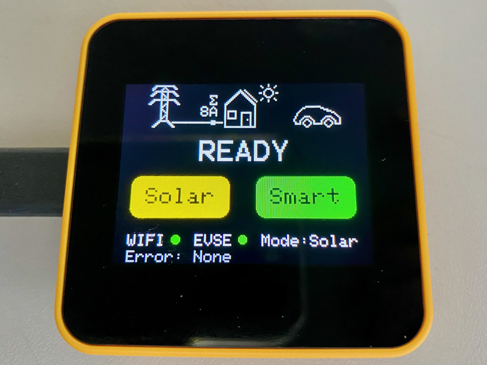

# SmartEVSE Display

SmartEVSE Display is a software project aimed at providing a display and control interface for
[SmartEVSE v3](https://www.smartevse.nl). It utilizes ESP32 microcontroller hardware along with various software
capabilities,
enabling users to monitor and control EVSE devices wirelessly.



## Features

- **WiFi Integration**:
    - Supports connection to WiFi networks for remote control and monitoring.
    - AP Mode support to configure the wireless network settings.

- **Smart EVSE Connectivity**:
    - Fetch and display real-time data from connected SmartEVSE.
    - Current grid consumption, charging status, errors, and operational mode display.

- **Display and Control**:
    - Interactive buttons for:
        - **Solar Mode**: Prioritizes solar power for charging.
        - **Smart Mode**: Optimized charging based on grid output.
        - **Configuration**: Allows for device setup.

- **Web Interface**:
    - Configuration of WiFi via a web browser.
    - QR code generation for network details.

## Software and Hardware Requirements

- **Hardware**:
    - ESP32 microcontroller; tested with M5Stack Tough device.
    - Display module compatible with ESP32.
    - Buttons or touch interface for control.

- **Software**:
    - Developed in C++11 for use with Arduino and ESP-IDF SDK.
    - Requires libraries for WiFi, HTTP communication, and mDNS.

## Usage

1. Connect the SmartEVSE Display hardware to the power source.
2. Configure the WiFi network (via AP mode or web interface).
3. Connect to a SmartEVSE by selecting the device found through mDNS.
4. Interact with the display buttons or web interface to monitor and control the EVSE system.
5. Check the display for real-time data updates, charging status, and any errors.

## License

This project is open-source and available under a free software license.

## Contribution

Developers are encouraged to fork the repository, submit bug fixes, or contribute new features and enhancements.

# Building the firmware

* Install platformio-core https://docs.platformio.org/en/latest/core/installation/methods/index.html
* Clone this github project, cd to the smartevse-display directory where platformio.ini is located
* Compile firmware.bin: `platformio run` (or `pio run`) <br>

Following these instructions on Linux:
```
sudo apt install platformio
git clone https://github.com/kozmoz/smartevse-display.git
cd smartevse-display.git
pio run
```